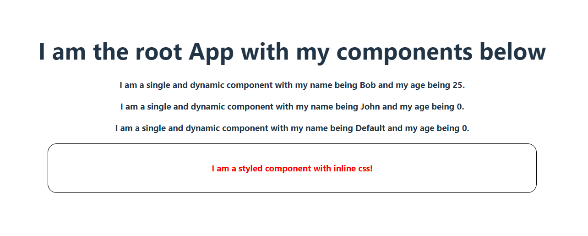

# Table of Contents

1. [What are Props in React](#what-are-props-in-react)
   - [Usage and Directionality](#usage-and-directionality)
2. [Creating Dynamic Components in React](#creating-dynamic-components-in-react)
   - [Using Props](#using-props)
   - [Destructuring Props](#destructuring-props)
   - [Setting Default Values for Props](#setting-default-values-for-props)
3. [Styling Components in React](#styling-components-in-react)
   - [Inline Styling](#inline-styling)
   - [External Styling](#external-styling)
4. [Code and output](#code-and-output)

## What are Props in React

Props (short for properties) are a way to pass data from parent components to child components in React. They allow you to make your components dynamic by providing values or configurations that can be used within the component.

### Usage and Directionality

Props are used to customize and configure child components. They are passed down from parent components to child components. The direction of data flow is from parent to child.

The `DynamicComponent` component accepts `name` and `age` as props. These props are set in the parent component (`App`) when rendering `DynamicComponent`:

```jsx
<DynamicComponent name="Bob" age={25}></DynamicComponent>
```

## Creating Dynamic Components in React

Dynamic components in React are components that can render different content or behavior based on the data they receive through props.

### Using Props

In the `DynamicComponent` function, the `name` and `age` props are used to dynamically display content. The component can render different names and ages based on the values passed to it when it's used in the parent component (`App`):

```jsx
function DynamicComponent({ name = "Default", age = 0 }) {
  return (
    <h3>
      I am a single and dynamic component with my name being {name} and my age
      being {age}.
    </h3>
  );
}
```

### Destructuring Props

The code demonstrates destructuring of props directly in the function argument. This technique allows you to easily access and use the props within the component without explicitly using `props.name` or `props.age`:

```jsx
function DynamicComponent({ name = "Default", age = 0 }) {
  // Destructured props used here
  return (
    <h3>
      I am a single and dynamic component with my name being {name} and my age
      being {age}.
    </h3>
  );
}
```

### Setting Default Values for Props

Default values for props can be defined to provide fallback values in case the props are not provided when the component is used. In the `DynamicComponent` function, default values are set for `name` and `age`, ensuring that the component can render even if these props are not passed:

```jsx
function DynamicComponent({ name = "Default", age = 0 }) {
  // Default values for props set here
  return (
    <h3>
      I am a single and dynamic component with my name being {name} and my age
      being {age}.
    </h3>
  );
}
```

## Styling Components in React

Styling components in React can be done both inline and externally using CSS.

### Inline Styling

In the `StyledComponent` function, inline styling is demonstrated using a JavaScript object (`developerStyle`) with CSS properties. The `style` attribute of the `<div>` element is set to apply the specified styles to the component:

```jsx
function StyledComponent() {
  const developerStyle = {
    margin: "20px",
    padding: "20px",
    border: "1px solid black",
    borderRadius: "20px",
    color: "red",
  };

  return (
    <div style={developerStyle}>
      <h3>I am a styled component with inline css!</h3>
    </div>
  );
}
```

## External Styling

External styling can be achieved by importing external CSS files and applying class names to components. This allows you to separate the styles from the component logic and maintain a cleaner code structure.

```jsx
import "./App.css";
```

## Code and output

### Code:

```jsx
import "./App.css";

function App() {
  return (
    <>
      <h1>I am the root App with my components below</h1>

      <DynamicComponent name="Bob" age={25}></DynamicComponent>
      <DynamicComponent name="John"></DynamicComponent>
      <DynamicComponent></DynamicComponent>
      <StyledComponent></StyledComponent>
    </>
  );
}

function DynamicComponent({ name = "Default", age = 0 }) {
  return (
    <h3>
      I am a single and dynamic component with my name being {name} and my age
      being {age}.
    </h3>
  );
}

function StyledComponent() {
  const developerStyle = {
    margin: "20px",
    padding: "20px",
    border: "1px solid black",
    borderRadius: "20px",
    color: "red",
  };

  return (
    <div style={developerStyle}>
      <h3>I am a styled component with inline css!</h3>
    </div>
  );
}
export default App;
```

### Output:


